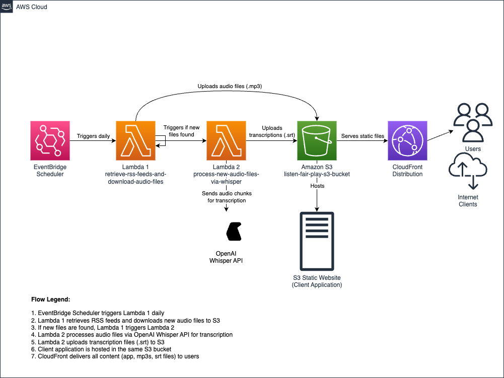

# Listen Fair Play - AWS Architecture Overview

This document provides a high-level overview of the AWS architecture for the Listen Fair Play project. For detailed information on specific components, please refer to their respective READMEs:

- [Processing Component](../processing/README.md)
- [Search Component](../search/README.md)
- [Client Component](../client/README.md)

## Core Components

1.  **EventBridge Scheduler**: Triggers the processing pipeline periodically.
2.  **Processing Lambdas**:
    *   `retrieve-rss-feeds-and-download-audio-files`: Fetches RSS feeds, downloads new audio files to S3, triggers the transcription lambda.
    *   `process-new-audio-files-via-whisper`: Transcribes audio files from S3 using OpenAI Whisper, saves `.srt` files to S3.
    *   *(Implicit Step)*: Generates a FlexSearch index from `.srt` files and uploads it to S3 (logic likely resides within the processing component, see `processing/README.md`).
3.  **Search Lambda (`search-indexed-transcripts`)**:
    *   Loads the FlexSearch index from S3.
    *   Handles search queries received via API Gateway.
4.  **API Gateway**: Provides an HTTP endpoint for the client application to invoke the Search Lambda.
5.  **Amazon S3 (`listen-fair-play-s3-bucket`)**:
    *   Stores raw audio files (`.mp3`).
    *   Stores transcription files (`.srt`).
    *   Stores the generated search index files.
    *   Hosts the static client application (React).
6.  **CloudFront Distribution**:
    *   Serves the client application and all S3 assets (audio, transcripts) via HTTPS.
    *   Provides CDN caching for improved performance.
7.  **Client Application**: A React-based web interface allowing users to search and view transcripts. Interacts with the Search Lambda via API Gateway.
8.  **OpenAI Whisper API**: External service used for transcription.

## High-Level Data Flow

1.  **Scheduler**: Triggers Lambda 1 (RSS retrieval).
2.  **Lambda 1**: Downloads new audio to S3, triggers Lambda 2.
3.  **Lambda 2**: Transcribes audio using Whisper, saves `.srt` files to S3.
4.  **Index Generation**: `.srt` files are processed into a search index stored in S3.
5.  **Client Search**: User performs a search in the client app.
6.  **API Gateway**: Forwards the search request to the Search Lambda.
7.  **Search Lambda**: Loads the index from S3 (if needed) and executes the search query.
8.  **Response**: Search Lambda returns results through API Gateway to the client.
9.  **Content Delivery**: Client app and media files (`.mp3`, `.srt`) are served to the user via CloudFront from S3.

## Diagram Updates Needed

The `aws-architecture.drawio.png` diagram needs to be updated to include:
- The Search Lambda (`search-indexed-transcripts`).
- API Gateway connecting the Client to the Search Lambda.
- Connections showing the Search Lambda reading the index from S3.
- Representation of the index generation step (reading `.srt` from S3, writing index to S3).
- Ensure all arrows accurately reflect the data flow described above.

## Notes

- All components operate in a serverless fashion
- The S3 bucket serves as both data storage and web hosting
- No backend server is needed beyond the serverless functions; the UI application runs entirely client-side.